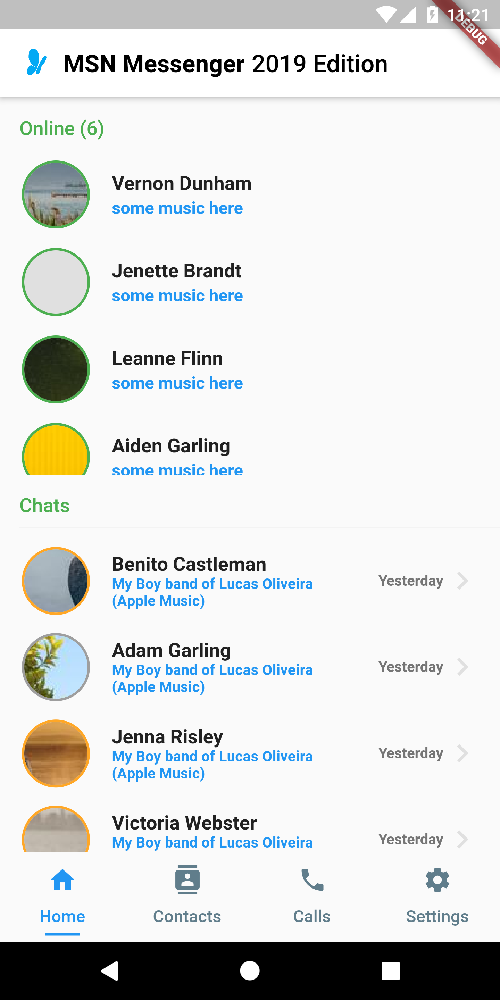
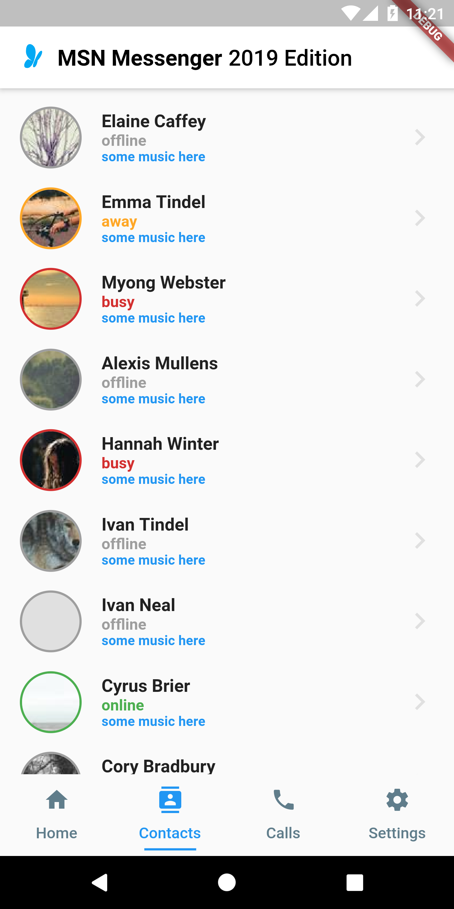

# *MSN MESSENGER* 2019 Edition

A simple mock of an ficticious app for the now dead MSN Messenger using material design and flutter.

This app is based on this [video](https://www.youtube.com/watch?v=ttLS5_44D7E)

## Getting Started

A few resources to get you started if this is your first Flutter project:

- [Lab: Write your first Flutter app](https://flutter.dev/docs/get-started/codelab)
- [Cookbook: Useful Flutter samples](https://flutter.dev/docs/cookbook)

For help getting started with Flutter, view our 
[online documentation](https://flutter.dev/docs), which offers tutorials, 
samples, guidance on mobile development, and a full API reference.

## How to run this app

- Fake Data Sever
  - Download [Mockoon App](https://mockoon.com/)
  - Open the `server.json` file and start the mocked server

- Application
  - *`Note`: This application application is meant to run on Android Emulator with a the proxy setup to access the mocked server at https://localhost:3000*

  - Clone this repository
  - run `flutter run` in your terminal

## Features
- `[X] Firebase Auth`
- `[X] Bloc Pattern`
- `[X] Mocked Data`
- `[X] List Online Friends`
- `[X] List Recent Chats`
- `[X] List All Friends`
- `[X] List Recent Calls`
- `[-] Account Settings `
- `[-] Chat Screen`
- `[-] Nudge!`
- `[-] Call Screen`

## Screenshots

